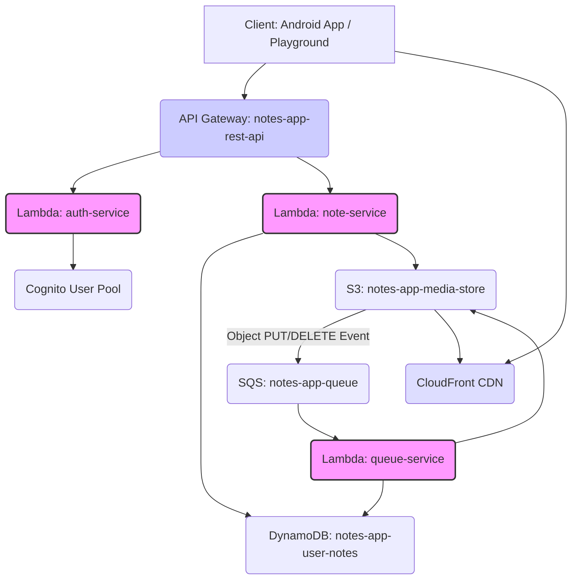

# 🚀 Notes App AWS Backend

A **serverless microservice-based backend** built using **AWS Lambda**, **DynamoDB**, **S3**, and **SQS**, all managed within an **Nx Monorepo**. This backend powers a modern **Notes App**, ensuring users can securely create, sync, and manage their notes and associated media across devices.

-----

## 📜 Content

  * [Project Overview](#-project-overview)
  * [Architecture Summary](#️-architecture-summary)
  * [Tech Stack](#️-tech-stackk)
  * [Configuration & Setup](#configuration--setup)
      * [AWS Configuration Guide](#aws-configuration-guide)
      * [Installation & Local Dev](#installation--local-dev)
      * [Publish & Deploy](#publish--deploy)
  * [Deep Dive: Learning Outcomes](#-deep-dive-learning-outcomes)
  * [Future Work](#-future-work)
  * [Contact](#️-contact)

-----

## 💡 Project Overview

The **Notes App** backend provides secure, scalable APIs to manage user notes and media, focusing heavily on **authentication** and **data synchronization**. It is specifically designed to function as a robust **sync service** for an **Android offline-first client**, guaranteeing user data is safe, consistent, and fully recoverable.

### Core Features

  * **User Authentication:** Secure access control handled by **AWS Cognito**.
  * **Note Management:** Complete CRUD (Create, Read, Update, Delete) support for notes (title and text content).
  * **Media Support:**
      * Allows up to **5 images per note**.
      * Secure media uploads managed via **AWS S3**.
      * Media cleanup (deletion) is handled **asynchronously** using **AWS SQS** to decouple the user request from slow cleanup tasks.
  * **Sync Logic:** Supports complex synchronization flows (create, update, delete) to maintain data consistency between the client's local database and the backend.

### Microservices

The repository is structured around a clean separation of concerns, utilizing three core microservices:

| Service | Primary Responsibility | Backing Technology |
| :--- | :--- | :--- |
| `auth-service` | User sign-up, sign-in, and token validation. | **Cognito**, **API Gateway** |
| `note-service` | Notes CRUD operations. | **DynamoDB**, **API Gateway** |
| `queue-service` | Listens to SQS and performs background/asynchronous tasks (e.g., media file cleanup). | **SQS** |

[Back to content](#-content)

## 🏗️ Architecture Summary

This section details the serverless architecture and the interaction between core AWS services.

### Service Interactions



### Playground

A dedicated, unauthenticated **API playground** is available for public testing.

  * **[Try it now](https://rahulstech.github.io/notes-app-aws-backend)**

> **⚠️ NOTE:** This playground is public. Please **do not share any sensitive information or media** here, as all notes and uploads are viewable by anyone.

### AWS Configuration Guide

For a step-by-step walkthrough of the **production AWS infrastructure setup** (IAM, DynamoDB, SQS, Cognito, and API Gateway routes), please refer to the dedicated document:

  * [**Complete Configurations Steps**](documents/AWSConfiguration.md)

[Back to content](#-content)

## 🛠️ Tech Stack

| Category | Components | Details |
| :--- | :--- | :--- |
| **Language** | **TypeScript** | Node.js 22 runtime for clean, type-safe code. |
| **Framework** | **Nx Monorepo** | Streamlined build, test, and dependency management across microservices. |
| **Cloud** | **AWS** | Lambda, DynamoDB, S3, SQS, CloudFront, API Gateway, Cognito, Cloudwatch. |
| **Testing** | **Jest**, **LocalStack** | Unit testing with Jest; Integration testing uses LocalStack to mock AWS services locally. |
| **Tooling** | **Bash** | Scripting for setup, testing, and deployment workflows. |

[Back to content](#-content)

## ⚙️ Installation & Local Dev

### Prerequisites

You **must** have the following installed to run the project locally (tested on Linux/WSL2):

  * **Node.js 22** and **npm**
  * **Docker** (required for LocalStack/integration tests)
  * **AWS CLI** (v2 recommended)
  * **Linux OS / WSL2** (due to reliance on **Bash** scripts)
  * **git**

### Quick Setup

1.  **Clone the repository:**
    ```bash
    git clone https://github.com/rahulstech/notes-app-aws-backend.git notes-app-aws-backend
    cd notes-app-aws-backend
    ```
2.  **Install dependencies:**
    ```bash
    npm install
    ```
3.  **Ensure prerequisites are met:**
    ```bash
    node -v && docker --version && aws --version
    ```

### Local Development (`dev` environment)

The `dev` environment relies on **LocalStack** to simulate DynamoDB locally. You must have **Cognito**, **S3**, and **SQS** set up in your actual `dev` AWS account for full functionality.

1.  **Prepare Local DynamoDB:** This script starts LocalStack and provisions the `notes-app-user-notes` table.
    ```bash
    npm run exe:database
    ```
2.  **Configure Environment:** Rename `.env-DEV-example` to **`.env-DEV`** and populate with your `dev` AWS service endpoints and credentials.
3.  **Start Microservices:** Run each service in its own terminal window.
    ```bash
    npm run dev:note-service
    npm run dev:queue-service
    npm run dev:auth-service
    ```

> **Testing Note Service:** In the local `dev` environment, the `note-service` will use a mock **GUEST** user if it does not find an `Authorization` header. To test with an authorized user, pass the **accessToken** received from the `auth-service` in the `Authorization` header as a **Bearer Token** (`Bearer <access-token>`).

### Integration Tests (`test` environment)

Integration tests use dedicated LocalStack containers for non-auth services (DynamoDB, S3, SQS) to guarantee reproducibility.

To run a service's integration test suite:

```bash
npm run test:integration:database-service

npm run test:integration:storage-service

npm run test:integration:queue-service
```

> **Test Script Workflow:** These commands automatically spin up necessary LocalStack containers, configure environment variables, execute the Jest test suite, and clean up the containers afterward.

### Troubleshooting

  * **Script Permissions:** If a bash script (`*.sh`) fails, ensure it is executable: `chmod +x /path/to/script.sh`.
  * **Docker Issues:** Verify your user has the correct permissions to run Docker commands without `sudo`.

[Back to content](#-content)

## 📤 Publish & Deploy

The **publish process** prepares the microservices for deployment by packaging them into AWS Lambda-ready `.zip` files.

### 1\. Publish (Build & Package)

The scripts in `scripts/publish/` build, package, and output the `.zip` file into a `publish/` folder.

| Action | Command |
| :--- | :--- |
| **All Services** | `npm run publish` |
| Individual Service | `npm run publish:auth-service` |
| Individual Service | `npm run publish:note-service` |
| Individual Service | `npm run publish:queue-service` |

### 2\. Deployment (Upload to AWS)

The `deploy.sh` script uploads the packaged `.zip` files and applies the production environment variables to the respective Lambda functions.

  * **Environment Variables:** Before deploying, rename `.env-PROD.json-example` to **`.env-PROD.json`** and ensure your production values are correct.

| Action | Command |
| :--- | :--- |
| **All Services** | `npm run deploy` |
| Individual Service | `npm run deploy:auth-service` |
| Individual Service | `npm run deploy:note-service` |
| Individual Service | `npm run deploy:queue-service` |

[Back to content](#-content)

## 🧠 Deep Dive: Learning Outcomes

This project was a significant learning milestone, serving as my **first Nx monorepo** and my **first real-world TypeScript project**. It yielded deep insights into modern serverless architecture and professional software design.

**TypeScript and Clean Design Mastery**

I moved beyond basic JavaScript to write robust, maintainable, and type-safe code:

  * **Advanced Typing:** Mastered configuring the **TypeScript compiler (`tsconfig.json`)** and effectively used utility types like `Omit`, `Partial`, `Pick`, and `Record`.
  * **Design Patterns:** Implemented **Interface-based design** for abstracting service contracts and used **Factory classes** for environment-specific client instantiation, adhering to **SOLID principles**.
  * **Special Types:** Gained practical experience applying `never`, `unknown`, and `any` correctly to enhance compile-time safety.

**Nx Monorepo Architecture**

  * **Structure:** Learned to structure the workspace with multiple applications and shared libraries.
  * **Automation:** Configured build, serve, and test targets for different environments, leveraging Nx executors to automate workflows efficiently.
  * **Code Sharing:** Successfully reused shared TypeScript interfaces and utilities across decoupled microservices.

**DynamoDB (NoSQL) Access Patterns**

This was a first-time deep dive into a NoSQL database, shifting the focus from SQL's normalization to **access pattern-driven denormalization**.

  * **Data Modeling:** Learned to define efficient key structures:
      * **Partition Key (`user_id`):** Defines the logical grouping for user data.
      * **Sort Key (`note_id`):** Defines individual items within a partition, enabling efficient lookups.
  * **Indexing:** Successfully implemented **Local Secondary Index (LSI)** and **Global Secondary Index (GSI)** to support diverse query requirements, such as listing all notes by a user sorted by `timestamp_created`.
  * **Performance:** Implemented **paged loading** to handle large datasets effectively, similar to SQL `LIMIT/OFFSET`.

**Serverless Asynchronous Design**

The use of **AWS SQS** was key to achieving service decoupling, leading to faster user response times and higher reliability.

  * **Decoupling Services:** When a note is deleted, the `note-service` pushes a lightweight **delete event** to SQS, instead of waiting for S3.
  * **Asynchronous Cleanup:** The dedicated **`queue-service`** consumes this event asynchronously, performs the media file cleanup on S3, and handles automatic retries in case of service failures.

**API Gateway and Lambda Proxy**

  * **Efficient Routing:** Learned the power of the **Lambda Proxy Handler** using the **`{proxy+}`** route pattern (e.g., `/auth/{proxy+}`). This funnels all sub-routes to a single Lambda, making the internal Express server responsible for routing, which drastically simplifies API Gateway configuration.
  * **Security Offload:** Learned to set up **Cognito as a JWT Authorizer** directly on API Gateway routes. This offloads the heavy task of token validation to AWS, passing requests to the Lambda **only** if the token is valid, which is a huge advantage for performance and code simplicity.

**S3 Management**

  * **Lifecycle Rules:** Understood how to use S3 Lifecycle to manage object storage (e.g., changing storage class or auto-deleting objects after a period).
  * **Secure Access:** Implemented **CloudFront CDN** as the public-facing layer, securely distributing media objects while restricting direct public access to the underlying S3 bucket.


**IAM Roles And Resource Policy**

* **Mastered IAM Access Control Mechanisms:** Gained a thorough understanding of the distinction between **Identity-Based Policies** (e.g., IAM Roles and User Policies) and **Resource-Based Policies**.
* **IAM Roles and Custom Policies:** **Hands-on experience** in implementing **IAM Roles**, creating **custom permission policies** (including deep knowledge of their JSON structure and components), and effectively attaching them to roles to define permissions for various AWS services and users.
* **Policy Functionality:** Clearly understand how **IAM Roles** provide temporary credentials and how **Identity Policies** (both Role and User policies) specify what actions an identity can perform.
* **Resource Policy Application:** Learned the function and structure of **Resource-Based Policies** to explicitly grant or deny access to a resource (like an S3 bucket or KMS key) for specified principals (users, roles, or other AWS accounts).
* **IAM User Policy Context:** Identified that **IAM User Policies** function similarly to Role Policies, granting specific permissions directly to an individual IAM user. Acknowledged the existence of **Identity Policies** (a broader category including User and Role policies) and their place in the IAM framework.

**Testing**

I designed and executed both **unit** and **integration** tests using **Jest**.

* **Unit tests** — focused on isolated modules using mocks.

* **Integration tests** — validated real interactions with AWS services through **LocalStack**.

* Learned Jest mocking strategies for AWS SDK calls and cross-service interactions.

* Implemented automated test scripts for reproducible and containerized testing environments.

[Back to content](#-content)

-----

## 🔮 Future Work

The foundation is strong, but the following enhancements are planned to evolve the application into a more robust platform:

1.  **Deployment Automation:** Implement Infrastructure as Code (IaC) via **Serverless Framework** or **AWS CDK** to fully automate the configuration and deployment of Lambda, API Gateway, and Cognito resources.
2.  **Rich Text Notes:** Upgrade note content storage to support rich text formatting (e.g., Markdown or HTML), improving the note-taking experience.
3.  **Advanced Filtering:** Introduce more sophisticated querying capabilities beyond creation date, including filtering by **tags, categories**, and searching by **title or keyword**.
4.  **Federated Authentication:** Integrate additional Identity Providers (Google, Facebook, etc.) into the Cognito User Pool.
5.  **API Versioning:** Implement multiple API versions (e.g., `/v1/`, `/v2/`) to ensure long-term client compatibility and graceful feature rollouts.

[Back to content](#-content)

-----

## ✉️ Contact

I'm keen to discuss this project, explore collaborative opportunities, or simply connect on backend and serverless development\!

  * **[GitHub](https://github.com/rahulstech)**
  * **[LinkedIn](https://www.linkedin.com/in/rahul-bagchi-176a63212/)**
  * **Email:** `rahulstech18@gmail.com`

[Back to content](#-content)